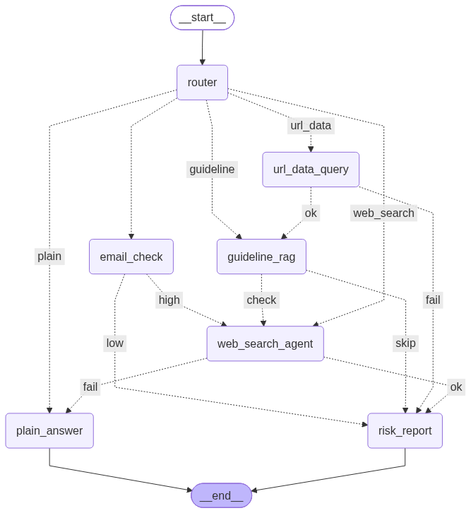

# 🎣 피싱 가드 에이전트 (Phishing Guard Agent)

## 한줄 요약

> 피싱 URL 통계, 이메일 본문 분석, 대응 가이드(RAG), 실시간 웹 위협 검색을 결합해
> 위험도를 판단하고 대응 방법을 안내하는 금융보안 멀티에이전트 챗봇

---

## 1. 파일 구조

```
phishing-guard-agent/
├── main.py                        # Streamlit UI (실행 진입점)
├── phishing_agent.py               # PhishingGuardAgent — LangGraph 멀티에이전트 정의
├── utils.py                         # pandas 코드 파싱/실행 유틸
├── requirements.txt
├── .env.example                      # 필요한 환경변수 목록 (실제 키는 .env에 별도 작성)
├── .streamlit/config.toml             # Streamlit 다크 테마
├── architecture.png                    # 그래프 구조도 (제출 시 [조]_[이름].png로 이름 변경)
├── README.md
└── data/
    ├── phishing_urls.csv               # 정형 데이터 (800행)
    ├── generate_phishing_urls.py        # 정형 데이터 생성 스크립트 (재현 가능)
    ├── phishing_response_guide.pdf       # 비정형 데이터 (대응 가이드)
    └── generate_guide_pdf.py              # 비정형 데이터 생성 스크립트 (재현 가능)
```

### 데이터 출처 안내

- `phishing_urls.csv`: 실제 피싱 URL 탐지 연구에서 널리 쓰이는 특징(IP 주소 포함 여부, `@` 기호,
  서브도메인 수, HTTPS 사용 여부, 도메인 나이 등)을 참고해 **직접 생성한 시뮬레이션 데이터**입니다.
  (수업에서 쓴 `security_logs.csv`와 동일하게, 통계적 특성을 반영한 합성 데이터 방식)
- `phishing_response_guide.pdf`: 일반적으로 알려진 피싱·스미싱 대응 원칙을 이 프로젝트의 RAG
  학습용으로 정리한 **참고 문서**입니다.
---

## 2. 실행 방법

### 2.1 패키지 설치

```bash
cd phishing-guard-agent
python3 -m venv .venv
source .venv/bin/activate      # Windows: .venv\Scripts\activate
pip install -r requirements.txt
```

### 2.2 API 키 설정

`.env.example`을 복사해 `.env`를 만들고 키를 채워주세요.

```bash
cp .env.example .env
```

```
OPENAI_API_KEY=sk-...
TAVILY_API_KEY=tvly-...
```

### 2.3 데이터 생성 (최초 1회, 이미 포함되어 있으므로 선택사항)

```bash
cd data
python generate_phishing_urls.py
python generate_guide_pdf.py
cd ..
```

### 2.4 앱 실행

```bash
streamlit run main.py
```

> 최초 실행 시 PDF를 임베딩하여 FAISS 인덱스를 만드는 데 약간의 시간이 걸립니다.
> 인덱스는 `data/phishing_response_guide/` 폴더에 캐싱되어 다음 실행부터는 즉시 로드됩니다.

---

## 3. 그래프 구조



```
                                    ┌── url_data ──→ url_data_query ──ok──→ guideline_rag
                                    │                        └──fail──→ risk_report
                                    │
                                    ├── email_check ──→ email_check ──high──→ web_search_agent
                                    │                          └──low──→ risk_report
START → [router] ──(CE1: 5갈래)──────┤
                                    ├── guideline ──→ guideline_rag ──check──→ web_search_agent
                                    │                        └──skip──→ risk_report
                                    │
                                    ├── web_search ──→ web_search_agent ──ok──→ risk_report
                                    │                          └──fail──→ plain_answer
                                    │
                                    └── plain ──→ plain_answer

risk_report → END
plain_answer → END
```

### 공유 상태 (`State`)

| Key | 설명 |
| --- | --- |
| `question` | 사용자 질문 (그래프 전체에서 전달) |
| `route` | `router`의 1차 라우팅 결과 |
| `data` | pandas 조회 결과 / 이메일 분석 결과 |
| `code` | `url_data_query`가 생성한 pandas 코드 |
| `context` | RAG 검색 결과 / 웹 검색 결과 |
| `matched_pattern` | [CE2] `url_data_query` 코드 실행 성공 여부 |
| `suspicion_level` | [CE3] `email_check` 판단 결과 (`high` / `low`) |
| `needs_web_check` | [CE4] 질문에 실제 도메인이 포함되어 실시간 확인이 필요한지 여부 |
| `search_success` | [CE5] `web_search_agent` 검색 성공 여부 |
| `generation` | 최종 답변 |

### 노드(7개) 정의

| 노드 | 역할 |
| --- | --- |
| `router` | 질문을 5가지 경로로 분류하는 라우터 (`temperature=0`) |
| `url_data_query` | `phishing_urls.csv`에 대한 pandas 조회/집계 코드를 생성·실행 |
| `email_check` | 사용자가 붙여넣은 이메일/문자 본문의 피싱 의심도를 LLM으로 분석 |
| `guideline_rag` | `phishing_response_guide.pdf`를 FAISS로 검색 (RAG) |
| `web_search_agent` | **Tavily Search API**로 도메인/사건 관련 최신 정보 검색 |
| `risk_report` | 지금까지 모인 데이터/컨텍스트를 종합해 위험도 등급과 함께 최종 답변 생성 |
| `plain_answer` | 데이터 없이 일반 질문에 바로 답변 (웹 검색 실패 시 폴백 경로로도 사용) |

### 조건부 엣지(5개) 설계 의도

| # | 위치 | 분기 기준 | 목적 |
| --- | --- | --- | --- |
| CE1 | `router` | LLM 분류 결과 (5갈래) | 질문 유형에 맞는 에이전트로 최초 라우팅 |
| CE2 | `url_data_query` | pandas 코드 실행 성공 여부 | 성공 시 관련 대응 가이드까지 함께 제공, 실패 시 즉시 리포트 |
| CE3 | `email_check` | 피싱 의심도 (`high`/`low`) | 의심도가 높을 때만 웹에서 추가 검증 (비용 절감) |
| CE4 | `guideline_rag` | 질문에 실제 도메인 포함 여부 | 실시간 확인이 필요한 경우에만 웹 검색 호출 |
| CE5 | `web_search_agent` | 검색 성공 여부 | 실패 시 일반 답변으로 자연스럽게 폴백 |

---

## 4. Streamlit Cloud 배포 방법

1. 이 폴더를 GitHub 리포지토리로 push
2. [share.streamlit.io](https://share.streamlit.io) 에서 New app → 리포지토리 선택, Main file path에 `main.py` 지정
3. **Settings → Secrets**에 아래 내용 등록 (로컬 `.env`와 동일한 키, 코드 수정 불필요 — `main.py`가 `.env`와 `st.secrets` 둘 다 자동으로 확인합니다)

```toml
OPENAI_API_KEY = "sk-..."
TAVILY_API_KEY = "tvly-..."
```

4. Deploy 후 발급된 URL을 제출

---

## 5. 동작 확인용 질문 예시

| 질문 | 기대 경로 |
| --- | --- |
| `IP 주소를 포함한 피싱 URL 비율은?` | `url_data_query` → (성공) → `guideline_rag` → `risk_report` |
| `이 문자 피싱 맞아? '계정이 잠깁니다, 즉시 링크 클릭해 인증하세요'` | `email_check`(high) → `web_search_agent` → `risk_report` |
| `이 문자 피싱 맞아? '내일 3시 회의입니다'` | `email_check`(low) → `risk_report` |
| `example-test.tk 사이트로 연결된 메일 열었어, 어떻게 해?` | `guideline_rag`(도메인 포함) → `web_search_agent` → `risk_report` |
| `피싱 이메일 식별 체크리스트 알려줘` | `guideline_rag`(도메인 없음) → `risk_report` |
| `최근 유행하는 스미싱 수법 뉴스 찾아줘` | `web_search_agent` → `risk_report` |
| `오늘 점심 뭐 먹지` | `plain_answer` |
